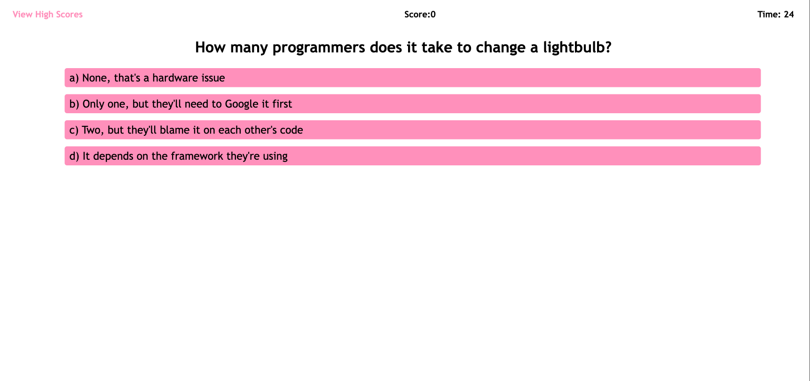

# 04 Web APIs: Code Quiz

## User Story

AS A coding boot camp student, I want to take a timed quiz on JavaScript fundamentals that stores high scores, so I can gauge my progress compared to my peers

## Acceptance Criteria

GIVEN I am taking a code quiz:

WHEN I click the start button, a timer starts and I am presented with a question
WHEN I answer a question, I am presented with another question
WHEN I answer a question incorrectly, time is subtracted from the clock
WHEN all questions are answered or the timer reaches 0, the game is over
WHEN the game is over, I can save my initials and my score

## Mock-Up

The following animation demonstrates the application functionality:

## Live Demo

A Live Demo Can be Found [Here](https://julianmlacey.github.io/Coding-Quiz-App/)

## License

View "LICENSE" in Repository
